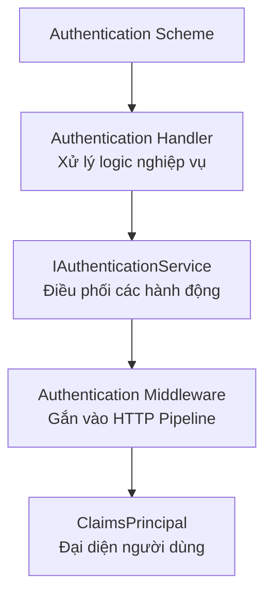

---
url: [/post/authentication-va-authorization-trong-net]
title: "Authentication và Authorization trong .NET"
$attribute: PostMetadata(Id = 2, Title = "Authentication và Authorization trong .NET", Category = "Bảo mật", LastModified = "05-10-2025")
$layout: BlogContentLayout
---

# Authentication (Xác thực) và Authorization (Phân quyền) là gì?

Trước khi đi vào chi tiết trong .NET, chúng ta cần phân biệt rõ hai khái niệm quan trọng 
thường bị nhầm lẫn:
- Authentication: Là quá trình xác minh danh tính người dùng. Nó trả lời câu hỏi 
"Bạn là ai?". Ví dụ: việc bạn đăng nhập vào email bằng tên và mật khẩu chính là xác thực.
- Authorization: Là quá trình xác định những gì người dùng được phép làm, sau khi 
danh tính của họ đã được xác thực. Nó trả lời câu hỏi "Bạn được phép làm gì?". 
- Ví dụ: sau khi đăng nhập vào email, bạn có thể đọc thư nhưng không thể đọc thư của người khác.

# Các thành phần chính trong .NET Authentication và Authorization 

Kiến trúc xác thực của ASP.NET Core được xây dựng xung quanh một số khối xây dựng chính. 
Bạn có thể hình dung mối quan hệ giữa chúng qua sơ đồ dưới đây:




##  Authentication Handler
Đây là "công nhân" trực tiếp thực hiện các nhiệm vụ xác thực cụ thể. 
Mỗi phương pháp xác thực sẽ có một Handler riêng:
- CookieAuthenticationHandler: Quản lý xác thực dựa trên cookie.
- JwtBearerHandler: Quản lý xác thực dựa trên JWT.
- OpenIdConnectHandler: Quản lý xác thực OpenIDConnect hay WS-Federation.
- RemoteAuthenticationHandler: Quản lý xác thực từ xa như OpenIDConnect.
Nhiệm vụ của Handler bao gồm:
- Authenticate: Đọc thông tin đăng nhập (như cookie, token) và xây dựng danh tính 
người dùng.
- Challenge: Phản hồi khi một người dùng chưa đăng nhập cố truy cập vào 
tài nguyên được bảo vệ (như chuyển hướng người dùng đến trang đăng nhập).
- Forbid: Phản hồi khi một người dùng đã đăng nhập nhưng không có 
quyền truy cập (trả về lỗi 403).

## Authentication Scheme

"Scheme" là một cái tên duy định danh cho một bộ xác thực cụ thể, 
giúp hệ thống biết cần sử dụng Handler nào. Khi cấu hình, bạn có thể đăng ký 
nhiều Scheme, ví dụ một Scheme cho cookie và một Scheme cho JWT Bearer Token.

```csharp
builder.Services.AddAuthentication(JwtBearerDefaults.AuthenticationScheme)
    .AddJwtBearer(JwtBearerDefaults.AuthenticationScheme, options => builder.Configuration.Bind("JwtSettings", options))
    .AddCookie(CookieAuthenticationDefaults.AuthenticationScheme, options => builder.Configuration.Bind("CookieSettings", options));
```

Trong ví dụ trên, chúng ta đăng ký hai Scheme: một cho JWT và một cho Cookie.

## IAuthenticationService

Đây là "bộ não" điều phối, cung cấp các phương thức như `SignInAsync`, `SignOutAsync`, 
`AuthenticateAsync` để các phần khác của ứng dụng (như Controller) sử dụng mà 
không cần quan tâm đến chi tiết Scheme nào đang được dùng.

## ClaimsPrincipal 

Sau khi xác thực thành công, thông tin người dùng được biểu diễn dưới dạng 
một `ClaimsPrincipal` object.

- `Claim`: Là một mảnh thông tin về người dùng, được lưu trữ dưới dạng cặp key-value. 
Ví dụ: Name: "Alice", Email: "alice@example.com", Role: "Admin".
- `ClaimsIdentity`: Một tập hợp các Claim, tương tự như căn cước công dân, giấy phép lái xe, hộ chiếu.
- `ClaimsPrincipal`: Chứa một hoặc nhiều ClaimsIdentity, đại diện cho người dùng hiện tại. 
Trong ứng dụng .NET, bạn có thể truy cập đối tượng này thông qua `HttpContext.User`.

# Cookie Authentication

Cookie Authentication là một trong những phương pháp xác thực phổ biến nhất trong các ứng dụng web. 
Nó sử dụng cookie để lưu trữ thông tin xác thực của người dùng sau khi họ đăng nhập thành công. 
Dưới đây là cách triển khai Cookie Authentication trong .NET:

**Bước 1: Đăng ký dịch vụ xác thực và cấu hình Scheme**

```csharp
var builder = WebApplication.CreateBuilder(args);

// Đăng ký dịch vụ xác thực với Scheme mặc định là Cookies
builder.Services.AddAuthentication(CookieAuthenticationDefaults.AuthenticationScheme)
    .AddCookie(options =>
    {
        options.Cookie.Name = "MyAppCookie";
        options.LoginPath = "/Account/Login"; // Đường dẫn tới trang đăng nhập
        options.AccessDeniedPath = "/Account/AccessDenied"; // Đường dẫn khi bị từ chối truy cập
        options.ExpireTimeSpan = TimeSpan.FromMinutes(20); // Thời gian cookie hết hạn
    });

builder.Services.AddControllersWithViews();

var app = builder.Build();

// QUAN TRỌNG: Middleware xác thực phải được đặt sau UseRouting và trước UseAuthorization
app.UseRouting();

app.UseAuthentication(); // Middleware này thiết lập HttpContext.User
app.UseAuthorization(); // Middleware này thực thi việc phân quyền

app.MapControllers();

app.Run();
```

**Bước 2: Đăng nhập và tạo Cookie**

Khi người dùng gửi thông tin đăng nhập, bạn sẽ tạo `ClaimsPrincipal` rồi 
gọi `SignInAsync` để tạo và lưu cookie

```csharp
[HttpPost]
public async Task<IActionResult> Login(LoginModel model)
{
    if (ModelState.IsValid)
    {
        var user = await AuthenticateUser(model.UserName, model.Password);
        
        if (user != null)
        {
            var claims = new List<Claim>
            {
                new Claim(ClaimTypes.NameIdentifier, user.Id),
                new Claim(ClaimTypes.Name, user.UserName),
                new Claim(ClaimTypes.Role, "Member"), 
                new Claim("FavoriteDrink", "Tea") 
            };

            var claimsIdentity = new ClaimsIdentity(claims, CookieAuthenticationDefaults.AuthenticationScheme);
            var claimsPrincipal = new ClaimsPrincipal(claimsIdentity);

            // Tạo cookie và đăng nhập
            await HttpContext.SignInAsync(CookieAuthenticationDefaults.AuthenticationScheme, claimsPrincipal);

            return LocalRedirect(model.ReturnUrl ?? "/");
        }
    }

    return View(model);
}
```

Để đăng xuất, bạn chỉ cần gọi `SignOutAsync`, hệ thống sẽ xóa cookie xác thực
```csharp
public async Task<IActionResult> Logout()
{
    await HttpContext.SignOutAsync(CookieAuthenticationDefaults.AuthenticationScheme);
    return RedirectToAction("Index", "Home");
}
```
